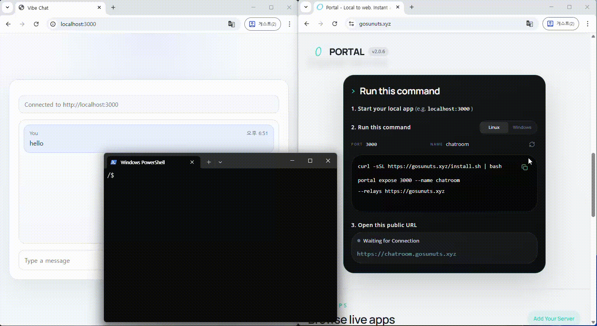

<p align="center">
  
</p>

# Portal - Self-Hostable Relay Tunnel for Localhost

[](https://github.com/gosuda/portal-tunnel/actions/workflows/ci.yml)
[](https://github.com/gosuda/portal-tunnel/releases/latest)
[](./LICENSE)
[](https://github.com/anderspitman/awesome-tunneling)

[English](./README.md) | [简体中文](./README.zh-CN.md)

<p align="center"></p>

<p align="center"><b>Expose local services through self-hosted or public relays.</b><br/>No port forwarding. No inbound firewall rules. No manual DNS setup. No accounts.</p>

## Why Portal?

Portal is an open-source tunnel runtime and relay network for publishing services to the agentic web. It exposes local apps, APIs, tools, and agents through self-hosted or public relays, keeps routing and security policy in the local tunnel process, and eliminates the need for hosted vendor accounts or credit cards.

- **Self-Hostable & Open Source** - Run your own relay with a single command. MIT-licensed with zero telemetry, no enterprise tiers, and no call-home.
- **Anonymous Relay Network** - Connect to public relays or combine self-hosted and community relays into resilient multi-relay failover pools.
- **End-to-End Tenant TLS** - For uncached HTTPS stream exposures, TLS terminates in your local tunnel process; relays never see plaintext or session keys.
- **IVNP-backed Overlay Networking** - Bridge reverse backhauls over an independent IVNP overlay network when enhanced routing privacy is desired.
- **Built-in MITM Detection** - Active self-probe compares TLS keying material on both ends to detect relay-side TLS termination; `--ban-mitm` bans compromised relays automatically.
- **No Accounts, No API Keys** - Authentication uses local secp256k1 cryptographic identities (`identity.json`) with SIWE challenge signing.
- **Native x402 Payments** - Route-level micropayments using gasless Sui USDC or Casper wCSPR without traditional payment processors.

> 📖 **Explore the Complete Product Capabilities**:
> For the complete matrix of all 20+ supported capabilities across CLI, Agent, SDK, and Relay—including interface support and trust boundaries—see the **[Canonical Feature Inventory](https://gosuda.github.io/portal-tunnel/features)**.

## Comparison

| | Portal | ngrok | Cloudflare Tunnel | frp |
|---|---|---|---|---|
| Public localhost URL | **Yes** | Yes | Yes | Yes |
| Self-hostable | **Yes** | Enterprise only | No | Yes |
| Open source | **MIT** | No | Client only | Apache 2.0 |
| Custom domain | **Yes** | Paid plans | Yes | Yes |
| End-to-end tenant TLS | **Yes (uncached exposures)** | No | No | No |
| MITM self-probe | **Yes (TLS keying material export)** | No | No | No |
| Multi-relay failover | **Yes** | Managed | Built-in | No |
| Account required | **No** | Yes | Yes | No |
| Native x402 payments | **Yes** | No | No | No |

## Quick Start

### 1. Expose a local service

**macOS / Linux:**
```bash
curl -fsSL https://github.com/gosuda/portal-tunnel/releases/latest/download/install.sh | bash
portal expose 3000
```

**Windows (PowerShell):**
```powershell
$ProgressPreference = 'SilentlyContinue'
irm https://github.com/gosuda/portal-tunnel/releases/latest/download/install.ps1 | iex
portal expose 3000
```

Portal prints an HTTPS URL immediately. Additional common usages:

```bash
# Custom name and explicit relay
portal expose 3000 --name myapp --relays https://portal.example.com --discovery=false

# Mount multiple local services behind one domain
portal expose --name myapp \
  --http-route /api=http://127.0.0.1:3001 \
  --http-route /=http://127.0.0.1:5173

# Dedicated raw TCP port (Minecraft, SSH, databases)
portal expose localhost:25565 --name minecraft --tcp

# Prefer an IVNP overlay backhaul path
portal expose 3000 --overlay
```

### 2. Use the local AI agent plugin

The repository includes a `portal-deploy` plugin with shared skills (`portal-expose` and `portal-connect`) for Codex, Claude Code, and Cursor:

```bash
# GitHub CLI
gh skill install gosuda/portal-tunnel portal-deploy/portal-expose

# skills CLI
npx skills add gosuda/portal-tunnel --skill portal-expose
```

Ask your agent: *"Expose my app on port 3000 with Portal and verify the public URL."* See [plugins/portal-deploy/README.md](plugins/portal-deploy/README.md) for full setup instructions.

### 3. Manage persistent tunnels with Portal Agent

When tunnels should run continuously in the background or as a system service:

```bash
portal agent run --config config.toml
portal agent dashboard --config config.toml
```

See the [Portal Agent Guide](https://gosuda.github.io/portal-tunnel/portal-agent) for configuration syntax and OS service installation.

### 4. Run your own relay

Deploy an open-source relay in seconds:

```bash
git clone https://github.com/gosuda/portal-tunnel
cd portal-tunnel && cp .env.example .env
docker compose up
```

See [Deployment](https://gosuda.github.io/portal-tunnel/deployment) for DNS automation (ACME), TCP/UDP port ranges, and production policy configuration.

## How End-to-End Encryption Works

```text
Browser
  -> Relay SNI router  (reads only routing token, forwards raw ciphertext)
  -> Reverse session
  -> Portal tunnel     (completes TLS handshake locally, derives session keys)
  -> Local service
```

1. **SNI Routing**: The relay accepts the incoming connection and reads only the TLS ClientHello for SNI-based lease routing.
2. **Raw Forwarding**: It forwards the raw encrypted stream over the reverse session without terminating TLS.
3. **Local Handshake**: The Portal tunnel completes the TLS handshake locally; session keys are derived on your machine.
4. **Keyless Signing**: For relay-hosted domains, the relay signs handshake transcripts via `/v1/sign`. The relay never receives session keys.
5. **Ciphertext Security**: The relay continues forwarding ciphertext without access to tenant plaintext.

## Public Relay Registry

Portal includes the official public relay registry by default:

```text
https://raw.githubusercontent.com/gosuda/portal-tunnel/main/registry.json
```

If you operate a public Portal relay, open a pull request to add your relay URL to `registry.json`.

## Documentation

- **[Feature Inventory](https://gosuda.github.io/portal-tunnel/features)** - Canonical inventory of all product capabilities and interfaces.
- **[Getting Started](https://gosuda.github.io/portal-tunnel/getting-started)** - Step-by-step setup and first exposure.
- **[Concepts](https://gosuda.github.io/portal-tunnel/concepts)** - Relay and tunnel ownership, transport modes, and overlay networking.
- **[Security Model](https://gosuda.github.io/portal-tunnel/security-model)** - Tenant TLS, keyless signing, and the static cache trust boundary.
- **[CLI Reference](https://gosuda.github.io/portal-tunnel/cli-reference)** - Complete command-line syntax and flag guide.
- **[Portal Agent](https://gosuda.github.io/portal-tunnel/portal-agent)** - Multi-tunnel daemon and interactive dashboard.
- **[Self-Hosting](https://gosuda.github.io/portal-tunnel/self-hosting)** - Running and securing your own relay instances.
- **[Configuration](https://gosuda.github.io/portal-tunnel/configuration)** - Environment variables and configuration options.
- **[API Reference](https://gosuda.github.io/portal-tunnel/api-reference)** - Relay wire protocol and client APIs.
- **[Maintainer Architecture](docs/maintainer/architecture.md)** - Internal Go package ownership and data flows.

## Contributing

See [CONTRIBUTING.md](CONTRIBUTING.md).

## License

MIT License - see [LICENSE](LICENSE).
